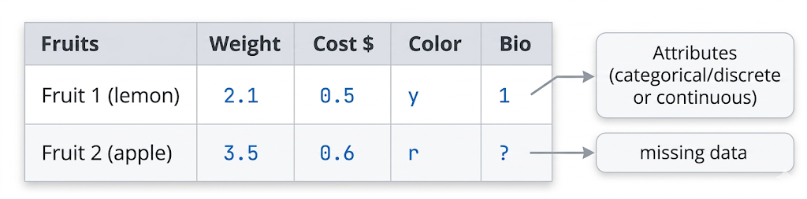
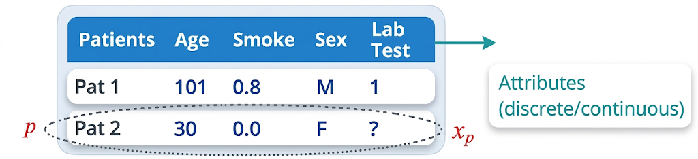
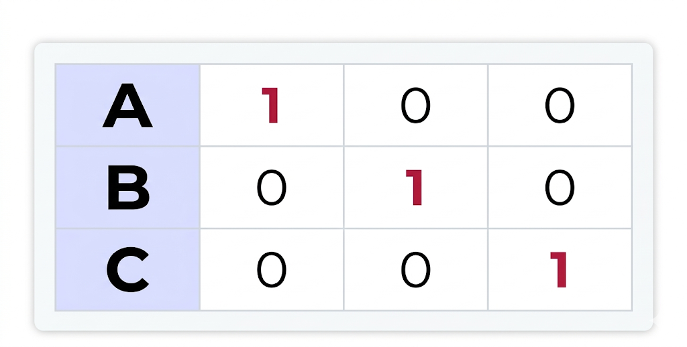
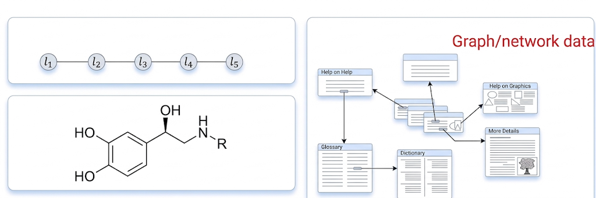
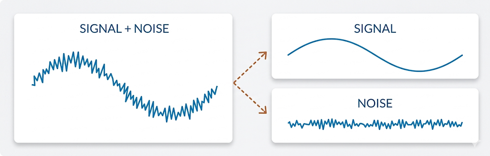
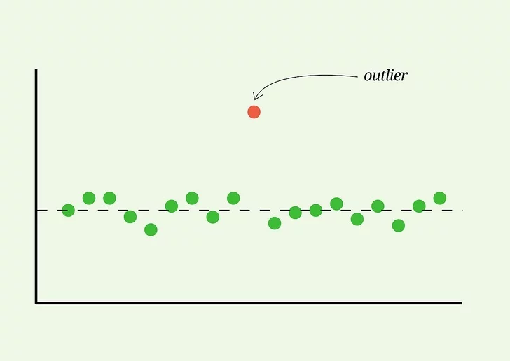

# Data Representation in Machine Learning

In Machine Learning, **data represents the experience or observations from the world** that the computer uses to learn patterns.

Before an algorithm can process this data, we have to decide **how to represent the data in a structured form** that a computer can understand.

Machine Learning systems rely on numerical representations of data, where observations are organized into structured formats that algorithms can analyze.

## 1. Flat Data and Basic Representation

The simplest and most common way to represent data is in a **flat format**, which looks exactly like a standard spreadsheet or a database table.

For example, consider a dataset describing fruits.

Each row represents an observation, and each column represents a measured property.

## 2. Terminologies: Rows vs. Columns

To formalize this for Machine Learning, let's use a medical records database to explain the standard terminology.

### Rows (Examples / Patterns / Instances)

Each **row** represents a single, independent observation or entity.

Examples include:

- one fruit
- one patient
- one email

In ML mathematics, a single row is often called a **pattern** or **instance** and is represented by a vector **$x$**.

The total number of rows is the dimension of the dataset, usually represented by the letter **$l$**.

### Columns (Features / Attributes)

Each **column** represents the specific properties being measured.

Examples include:

- age
- weight
- cost
- lab test results

These properties are called **features** or **attributes**.

The total number of features is the dimension of the input, represented by **$n$**.

If we want to point to a specific piece of data, like the 3rd attribute of the 2nd patient, we use indexing, such as $x_{p,i}$ ($x_{2,3}$).

where:

- $p$ is the pattern (row)
- $i$ is the feature (column)

## 3. Data Encoding

Computers only understand numbers, so we have to translate text and categories into a numerical format before feeding them to the algorithm.

This process is called **encoding**.

---

### Binary Categories

If a feature has only two possible values, we can easily encode it using numbers.

Examples:

- True / False
- Yes / No
- Male / Female

These can be encoded as:

0 , 1

or sometimes:

-1 , +1

---

### Ordered Categories

Some categories have a **natural ordering**.

Examples include:

- Small
- Medium
- Large

These can be encoded numerically as:

1 = Small
2 = Medium
3 = Large

because the order carries meaningful information.

---

### One-Hot Encoding (1-of-k Encoding)

Sometimes categories have **no natural ordering**.

For example:

A, B, C

If we encoded them as

1, 2, 3

Example representation:

A → (1,0,0)
B → (0,1,0)
C → (0,0,1)

Each category activates exactly **one position in the vector**.

## 4. Complex Data Structures

While flat tables are common, real-world data is often **highly complex and structured**.

Machine Learning must sometimes handle data structures such as:

- sequences (text or DNA)
- trees
- graphs
- multi-relational databases

For example:

- The **internet** can be represented as a graph of web pages connected by hyperlinks.
- A **molecule** can be represented as a 3D structure of atoms connected by chemical bonds.

## 5. Dealing with Messy Data

Real-world data is rarely perfect.

Before training a model, data often requires **preprocessing**.

Three common issues appear in datasets.

---

### Noise

Noise refers to **random errors in measurements** that distort the true signal.

For example, Gaussian noise can make a smooth mathematical curve appear jagged.

---

### Outliers

Outliers are **extreme values that differ significantly from the rest of the data**.

They are often caused by:

- measurement errors
- data entry mistakes
- unusual events

Outliers can strongly affect Machine Learning models and often need to be detected and handled.

---

### Feature Selection

Sometimes datasets contain **hundreds or thousands of features**, but many of them are irrelevant.

Feature selection is the process of identifying the **most informative attributes** and removing unnecessary ones.

This can:

- improve model performance
- reduce computation
- simplify the learning problem
