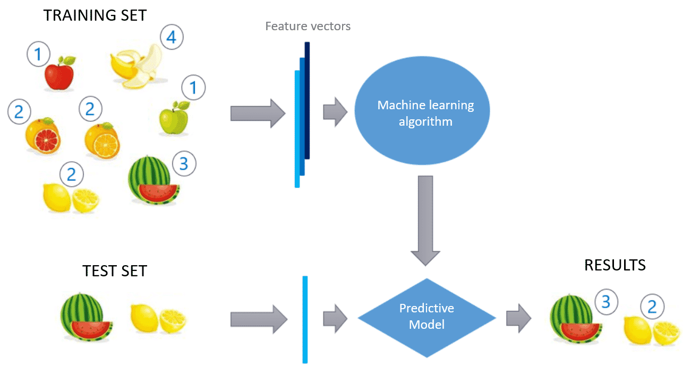
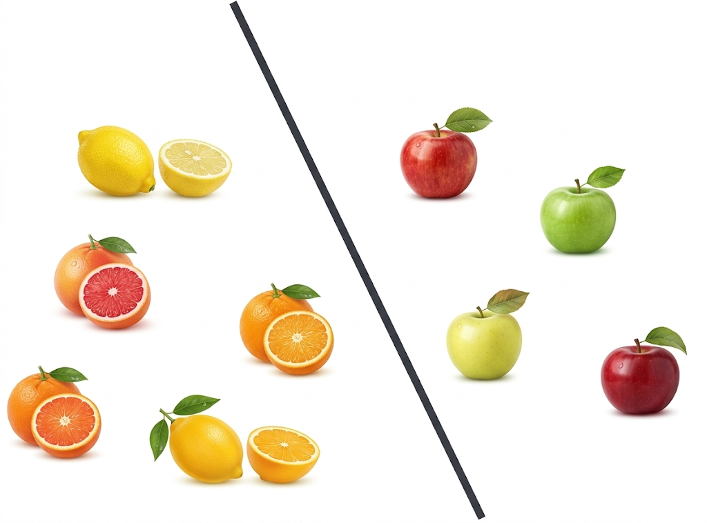
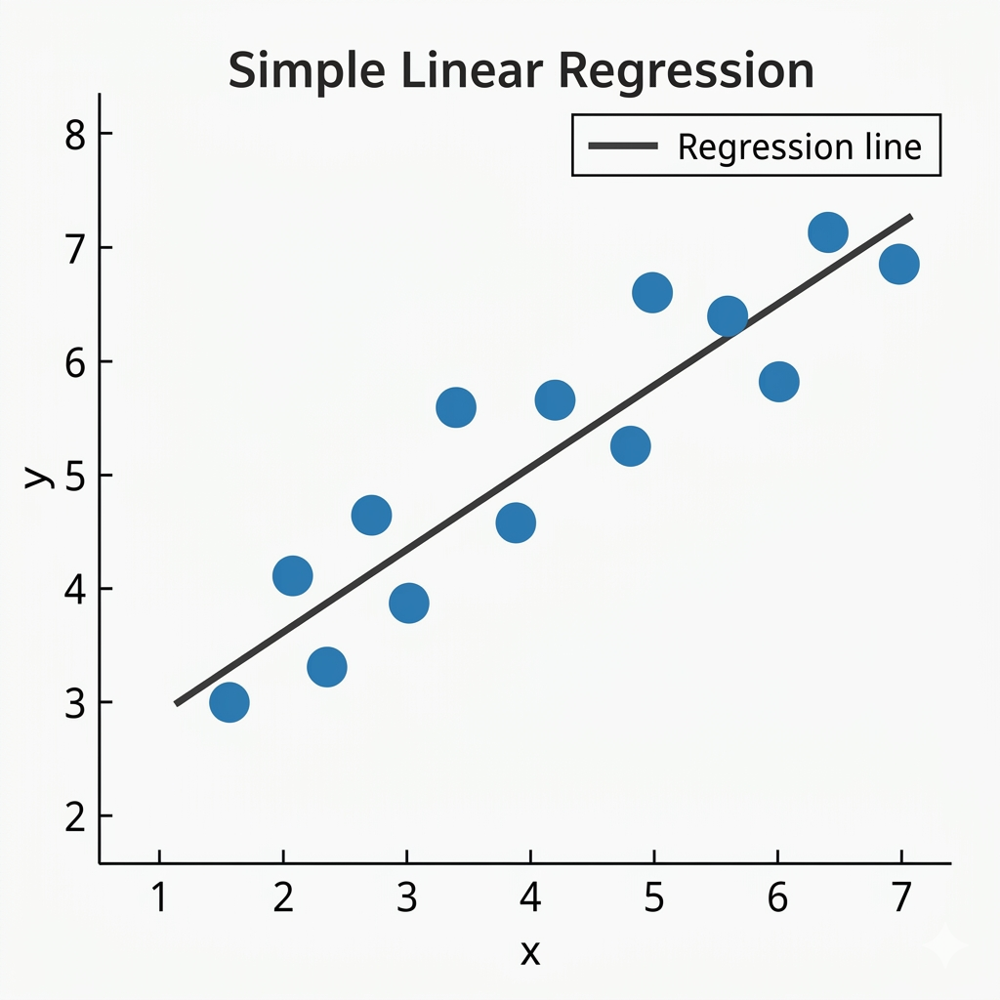
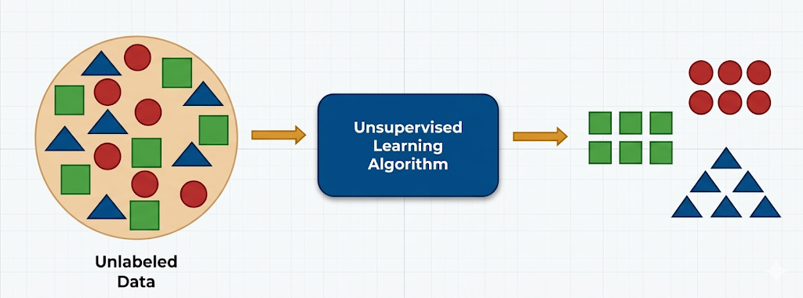
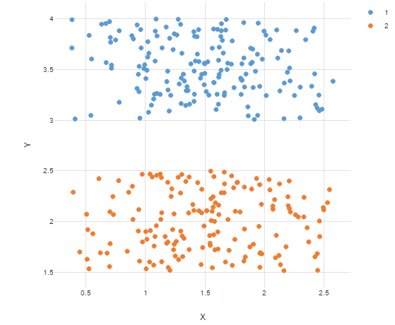
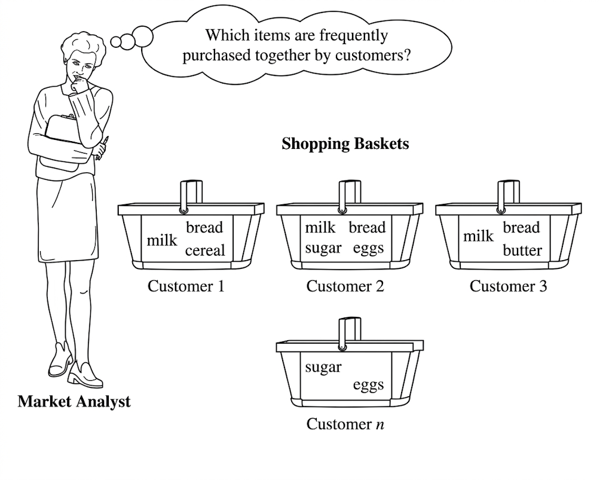

# Machine Learning Tasks

Before building a Machine Learning system, we must clearly define the **task the system is supposed to solve**.

In other words, we must answer the question:

> What problem are we trying to solve with data?

To define the task, a data scientist must answer three fundamental questions.

---

## Defining the Purpose of the System

### 1. What knowledge do we want to achieve?

Are we trying to:

- extract hidden patterns from a dataset (Data Mining)
- build a reusable predictive model (Machine Learning)

Data Mining typically focuses on **discovering patterns in existing data**, while Machine Learning focuses on **building models that generalize to new data**.

---

### 2. What is the useful nature of the result?

We must decide how the output will be used.

For example:

- predicting house prices
- detecting spam emails
- recommending products
- identifying handwritten digits

The nature of the result determines the **type of learning task**.

---

### 3. What information is available?

The available data strongly affects the type of task.

We must determine whether the data is:

- **labeled** (the correct answers are provided)
- **unlabeled** (no answers are given)

This distinction leads to different categories of Machine Learning tasks.

---

# Main Categories of Machine Learning Tasks

Machine Learning tasks are generally divided into **two major families**.

---

## 1. Predictive Tasks

Predictive tasks aim to **predict unknown outcomes based on known examples**.

The goal is to learn a mathematical function that maps input data to the correct output.

This process is often described as **function approximation**.

The model learns a function:

Predictive tasks usually rely on **labeled data**, meaning the correct answers are already known during training.

---

### Supervised Learning

In supervised learning, the algorithm receives training examples in the form:

(**$x$**, **$d$**)

where:

- **$x$** = input data
- **$d$** = desired output (target label)

The dataset therefore consists of pairs:

(**$x_1$**, **$d_1$**), (**$x_2$**, **$d_2$**), ..., (**$x_n$**, **$d_n$**)

We assume there exists an unknown true function **$f$** that maps inputs to outputs:

**$f(x)$**

Since this function is unknown, the algorithm tries to learn an approximation called a **hypothesis h**.

The goal is for the hypothesis to approximate the true function:

**$h(x)$** ≈ **$f(x)$**

A key objective of supervised learning is **generalization**, meaning the model should perform well not only on the training data but also on **new, unseen examples**.

---

### Classification

Classification predicts **discrete categories**.

Examples include:

- spam vs non-spam email
- disease diagnosis (positive or negative)
- handwritten digit recognition (0–9)

Example:

Recognizing handwritten digits is a **classification task** because the model must assign an image to one of several categories (0–9).

---

### Regression

Regression predicts **continuous numerical values**.

Examples include:

- house prices
- temperature forecasting
- stock prices

Unlike classification, regression outputs **numbers instead of categories**.

---

## 2. Descriptive Tasks

Descriptive tasks aim to **discover hidden patterns in data without predefined answers**.

In these tasks, the algorithm explores the dataset and tries to identify structures or relationships.

These tasks typically use **unlabeled data**.

---

### Clustering

Clustering attempts to **group similar data points together**.

The algorithm identifies natural groupings within the data.

Examples include:

- customer segmentation
- grouping similar documents
- identifying communities in social networks

Each group formed by the algorithm is called a **cluster**.

---

### Association Rules

Association rule learning finds **relationships between items in datasets**.

This technique is often used in **market basket analysis**.

Example:

A store may discover that customers who buy:

- bread
- peanut butter

often also buy:

- jam

These relationships help businesses understand **co-occurrence patterns** in customer behavior.
