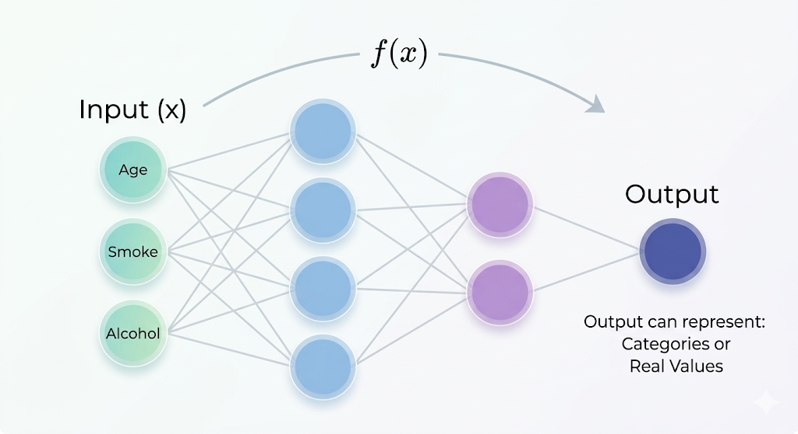

# Machine Learning Models

After defining the **task** and understanding the **data**, the next step in building a Machine Learning system is choosing a **model**.

---

## What is a Model?

A model is a mathematical or logical structure used to **capture the relationship between input data and outputs**.

Its goal is to:

> **represent the hidden patterns in the data in a form that can be used for prediction or analysis**.

---

### The Language of the Model

Every model describes relationships using a specific **language**.

This language can take different forms:

- mathematical equations
- logical rules
- probabilistic representations

The choice of this language determines **how the system represents knowledge**.

---

### Model as a Function

In most Machine Learning settings, a model is represented as a function:

**$h(x, w)$**

where:

- **$x$** = input data
- **$w$** = parameters (adjustable values of the model)
- **$h$** = the function (model)

The parameters **$w$** are learned from data.

---

## Core Terminology

To understand how models work, we introduce some key concepts.

### Training Example

A training example is a pair:

(**$x$**, **$y$**)

where:

- **$x$** = input data
- **$y$** = target value (desired output)

In real-world data, the target often includes noise:

**$y$** = **$f(x)$** + noise

---

### Target Function (**$f$**)

The **target function $f$** is the true underlying relationship between input and output.

- It represents the real rule governing the data
- It is **unknown** in practice

---

### Hypothesis (**$h$**)

The model does not know the true function **$f$**, so it learns an approximation:

**$h(x)$**

This approximation is called a **hypothesis**.

The goal is:

**$h(x) ≈ f(x)$**

---

### Hypothesis Space (H)

The **hypothesis space H** is the set of all possible functions the model can represent.

Examples:

- all possible straight lines
- all possible decision rules
- all possible neural network configurations

The choice of model determines the hypothesis space.

---

## Types of Models (Hypothesis Spaces)

Different models represent data in different ways.

### 1. Linear Models

Linear models use **continuous mathematical functions**.

Example:

**$h(x) = w₁x + w₀$**

For classification:

**$h(x) = sign(wᵀx + w₀)$**

These models are:

- simple
- interpretable
- based on weighted combinations of inputs

---

### 2. Symbolic (Rule-Based) Models

These models use **logical rules**.

Example:

```

if (x₁ = 0) and (x₂ = 1)
then h(x) = 1
else
h(x) = 0

```

They are:

- easy to interpret
- similar to traditional programming logic

Examples inlcude:

- Decision Trees

- Inductive Logic Programming

- Evolutionary Algorithms

---

### 3. Probabilistic Models

These models describe relationships using **probability distributions**.

They estimate:

**$p(x, y)$**

This allows the system to:

- model uncertainty
- compute likelihoods
- make probabilistic predictions

Examples include:

- Traditional Parametric Models

- Graphical Models (Bayesian Networks, Naïve Bayes, and Hidden Markov Models)

---

### 4. Instance-Based Models (K-Nearest Neighbors)

These models do not build a global function.

Instead, they:

- store training examples
- compare new data to existing data

Example:

To predict a value:

- find the **K nearest neighbors**
- compute their average (for regression)

---

### 5. Neural Netwoks

Neural networks are powerful models capable of learning **complex, non-linear relationships** between inputs and outputs.

They can be viewed as computational models that:

- take an input vector **x**
- process it through multiple layers
- produce outputs such as **categories or real values**

Unlike linear models, neural networks can represent highly complex functions.

<p align="center">  </p>

Neural networks define a **class of functions** that can approximate very complicated patterns in data.

This makes them suitable for tasks such as:

- image recognition
- natural language processing
- speech recognition

## Choosing the Right Model

A natural question arises:

> Is there a single best model for all problems?

---

### No Free Lunch Theorem

The answer is **no**.

The **No Free Lunch Theorem** states that:

> There is no universally best learning algorithm that works optimally for every possible problem.

If a model performs very well on one type of problem, it must perform worse on others.

---

### Why This Matters

Because of this limitation:

- there is no "one-size-fits-all" solution
- different problems require different models
- choosing the right model is a key part of Machine Learning

---

### Comparing Models

Models are not equivalent. They differ in important ways:

#### 1. Flexibility (Expressiveness)

Some models can represent very complex relationships.

- Linear models → limited (simple relationships)
- Neural networks → highly flexible (complex patterns)

#### 2. Control of Complexity

Highly flexible models can easily become too complex.

This can lead to:

- overfitting (memorizing data instead of learning patterns)

Different models provide different ways to control this complexity.

---

### Core Insight

Modern Machine Learning is about finding the right balance:

> Using models that are flexible enough to capture patterns,  
> while controlling their complexity to ensure good generalization.
