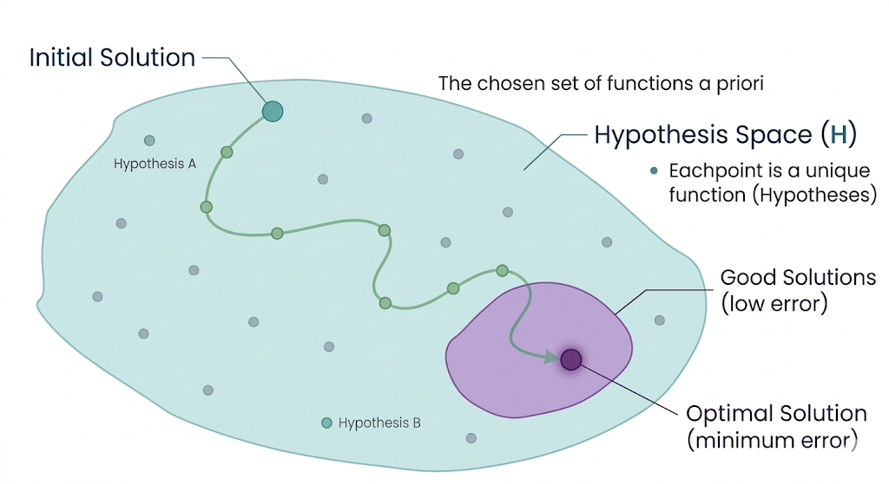

# Machine Learning Learning Algorithms

## What is a Learning Algorithm?

Once we define the **Data**, the **Task**, and the **Model**, we need a mechanism that actually **learns from the data**.

This mechanism is called the **Learning Algorithm**.

A learning algorithm is responsible for:

> Finding the best possible model (hypothesis) that fits the data.

---

## Learning as a Search Problem

The core idea is simple:

> Learning = searching for the best hypothesis in a space of possible solutions.

The algorithm searches within the **Hypothesis Space (H)**, which contains all possible functions the chosen model can represent.

Each possible solution corresponds to a different hypothesis:

- different parameters (e.g., weights in a linear model)
- different rules (in symbolic models)

## Objective: Minimizing Error

To determine what “best” means, the algorithm evaluates how well each hypothesis fits the training data.

The goal is to:

> Find the hypothesis that **minimizes error**.

This error measures the difference between:

- the predicted output **$h(x)$**
- the true output **$f(x)$** (or target values)

## Parameter Tuning

In practice, learning means **adjusting model parameters**.

Examples:

- In a linear model: finding optimal weights **w**
- In rule-based models: selecting the best logical rules

For example, if the model is:

**$h_w(x) = w_1 x + w_0$**

the algorithm searches for values of:

- **$w_1$**
- **$w_0$**

that minimize prediction error.

## The Search Process

Since the hypothesis space is often extremely large, the algorithm cannot check every possibility.

Instead, it uses **heuristic search methods**.

Typical process:

1. Start with an **initial solution**
2. Evaluate its error
3. Adjust parameters to improve performance
4. Repeat until a good solution is found

## Visualizing the Learning Process

The diagram illustrates the learning process:

- The **large region** represents the Hypothesis Space (H)
- Each point is a different possible model
- The **purple region** represents solutions that fit the training data well
- The algorithm starts from an **initial solution**
- It moves step-by-step (local search) toward a better solution
- The goal is to reach the **optimal solution** (minimum error)

## Inductive Bias

A key limitation:

> The algorithm cannot explore all possible functions.

Reasons:

- The hypothesis space may not include the true function
- The space is too large for exhaustive search

To overcome this, the algorithm relies on **inductive bias**:

> Assumptions that guide the learning process toward good solutions.

Without inductive bias, learning would not be possible.

## What Comes Next

So far, we have seen how a learning algorithm searches for the best hypothesis.

However, three critical questions remain:

- How do we guide the search? → Inductive Bias
- How do we measure “best”? → Loss Functions
- How do we ensure real-world performance? → Generalization & Validation

These concepts are explored in the next sections.
