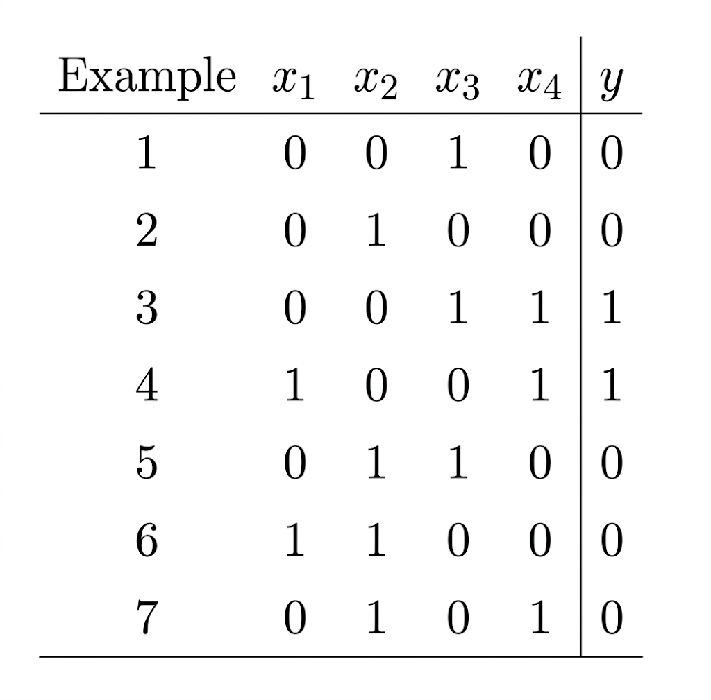
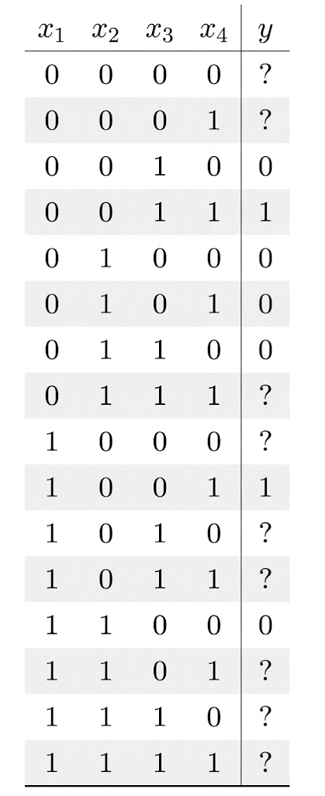

# Inductive Bias in Machine Learning

## What is Inductive Bias?

In Machine Learning, we are trying to learn an **unknown function** ( f ) from limited data.

However, learning from data alone is not enough.

> A learning algorithm must make **assumptions** about the problem in order to generalize.

These assumptions are called **Inductive Bias**.

## Why Inductive Bias is Necessary

Without any assumptions, a model cannot decide between multiple valid solutions.

> Many different hypotheses can perfectly fit the same training data.

As a result:

- the model cannot choose the “correct” function
- it cannot make reliable predictions on unseen data
- it fails to **generalize**

## Types of Inductive Bias

### 1. Language Bias (Model Bias)

This restricts the **hypothesis space ( H )**.

Examples:

- Linear models → only straight-line relationships
- Neural networks → can represent complex patterns

### 2. Search Bias (Algorithm Bias)

This affects **how the algorithm searches** within the hypothesis space.

For example:

- preferring simpler models
- following specific optimization paths

## Example: Learning Boolean Functions

We consider a simple problem:

- Input: x = (**$x_1, x_2, x_3, x_4$**) (binary features)
- Output: **$y$** → {0,1}

## Why the Problem is Ambiguous

With 4 binary inputs:

**$2^4 = 16$** possible inputs

Each input can map to 0 or 1, so:

|H| = **$2^{16} = 65,536$**

There are **65,536 possible functions**.

## After Observing Limited Data

Suppose we only observe **7 training examples**.

That means:

- 7 inputs → known outputs
- 9 inputs → **unknown outputs**

Each of the 9 unknown inputs can be either 0 or 1:

**$2^9 = 512$**

So there are **512 different functions** that all match the training data.

## Why the Model Cannot Decide

Let’s take a **concrete unseen input**:

**$x = (1,1,1,1)$**

This input was **not in the training data**.

Now consider two possible hypotheses:

- **Hypothesis A:** **$h(x) = 0$**
- **Hypothesis B:** **$h(x) = 1 $**

Both:

- perfectly match all 7 training examples
- but give **different predictions** for this new input

So which one is correct?

> The model has **no way to decide**.

## The Real Problem

The issue is not just missing data.

> The problem is that **multiple hypotheses are equally valid**.

This creates **ambiguity**.

## The Lookup Table Problem

Without inductive bias, the model behaves like a:

> **Lookup Table Learner**

It:

- memorizes training examples
- only works on seen inputs
- fails on new data

## No Bias ⇒ No Generalization

> Without inductive bias, learning is impossible.

Because:

- too many valid solutions exist
- no preference between them
- predictions become arbitrary

## Key Takeaway

Inductive bias is not a limitation — it is a **requirement**.

It allows Machine Learning systems to:

- reduce the number of possible solutions
- choose meaningful hypotheses
- generalize to unseen data

## Final Insight

> A model’s job is not just to predict —
> it is to **make consistent and justifiable predictions**.

Inductive bias is what makes this possible.
